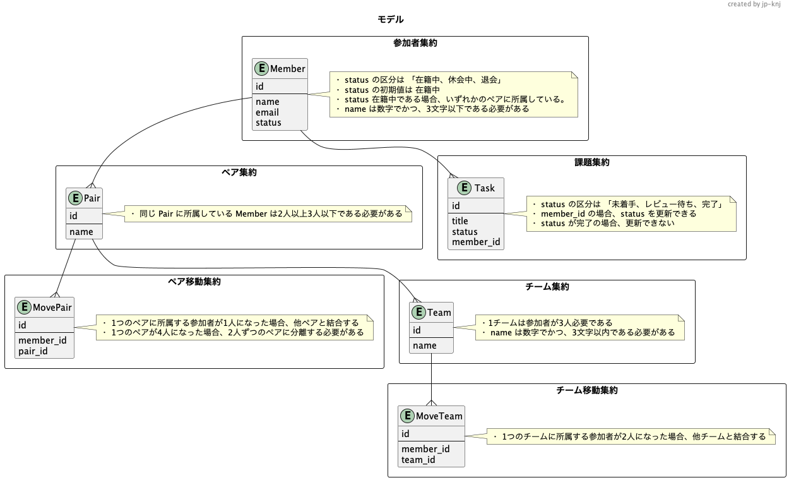
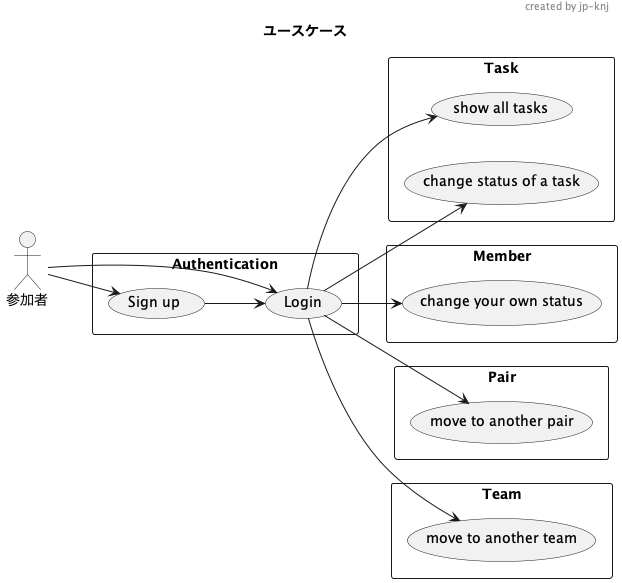
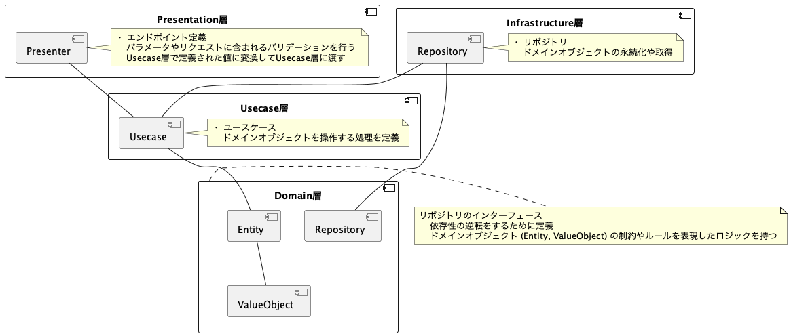

# learn_ddd

## Tech
#### server
- NestJS  

#### client
- React

#### Other
- yarn workspace
- prettier
## Task
[Domain](https://airtable.com/appPxhCPFYGqqN9YU/tblVlFr2q4lIqDKYc/viwX8r6DpCRp80swL/recZs7kxeZqeZlph6?blocks=hide)
## Model

[Draft](https://www.figma.com/file/tElrBijupEOvtdxXNUSuEi/PrAha-Model?node-id=0%3A1)

## Usecase

## Architecture
